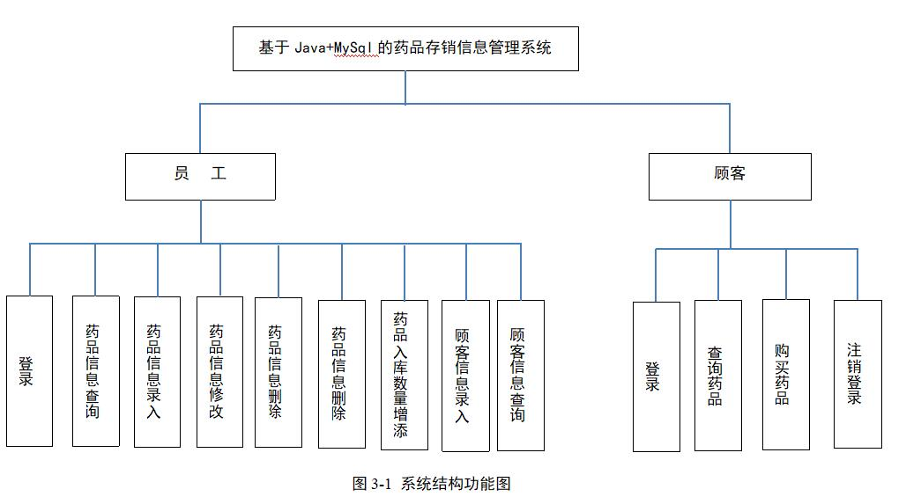
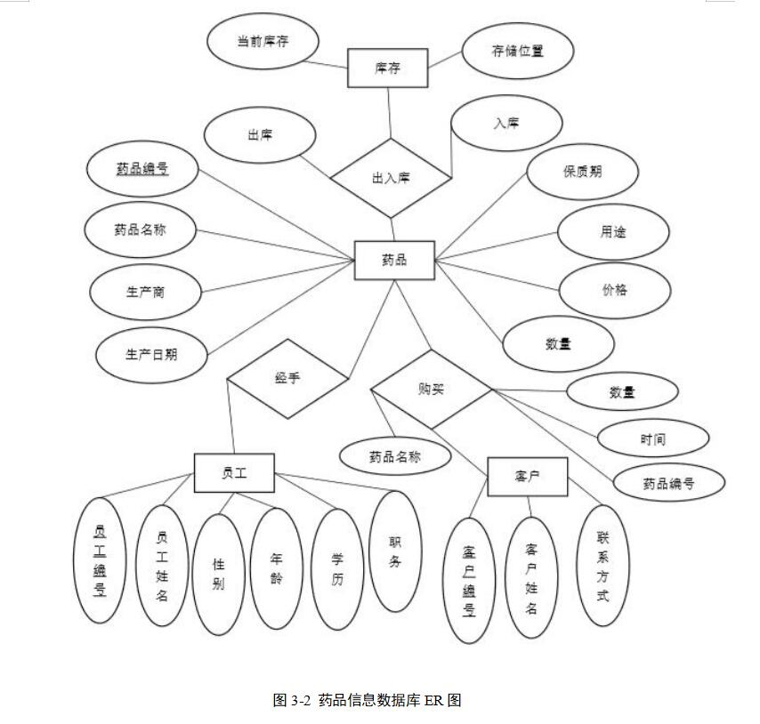
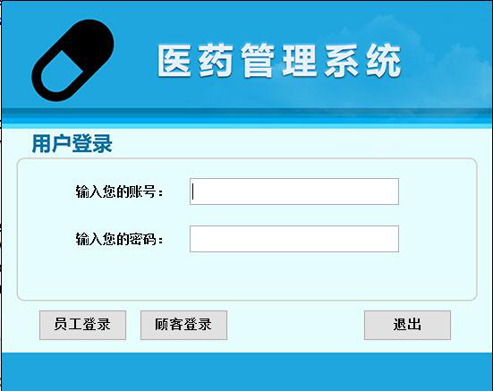
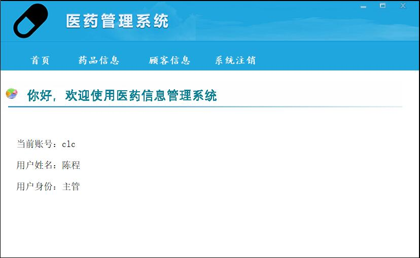
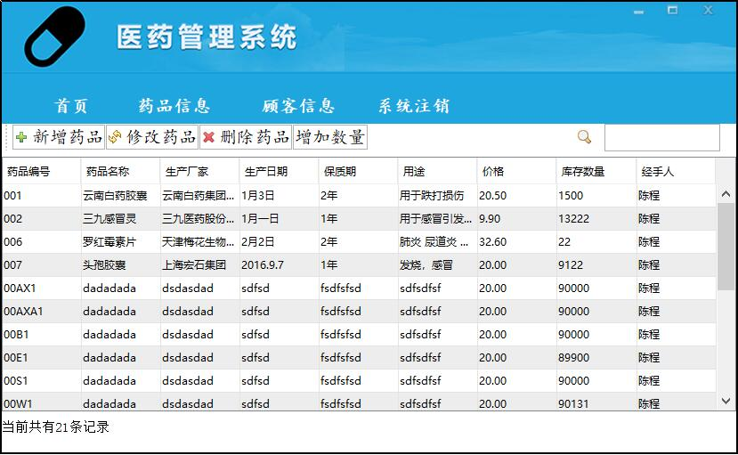
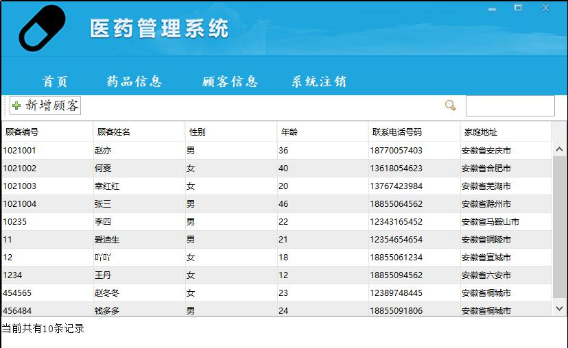
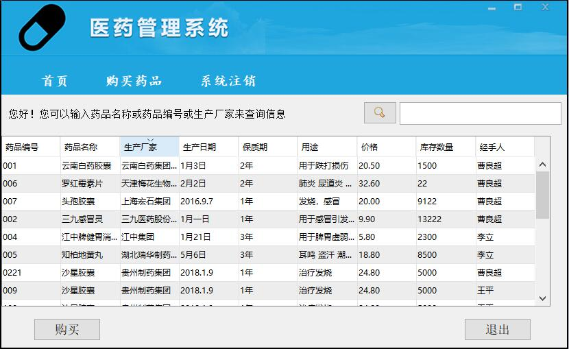

# Medical-management-system
简单的药品存销管理系统
    药品存销管理系统主要需要实现员工登录、药品信息查询、药品信息录入、药品信息修改、药品信息删除、药品入库数量增添、顾客信息录入、顾客信息查询、顾客登录、顾客查询药品、顾客购买药品等功能
  </a>
  </a>
  </a>
  </a>
  </a>
  </a>
  </a>
  </a>
